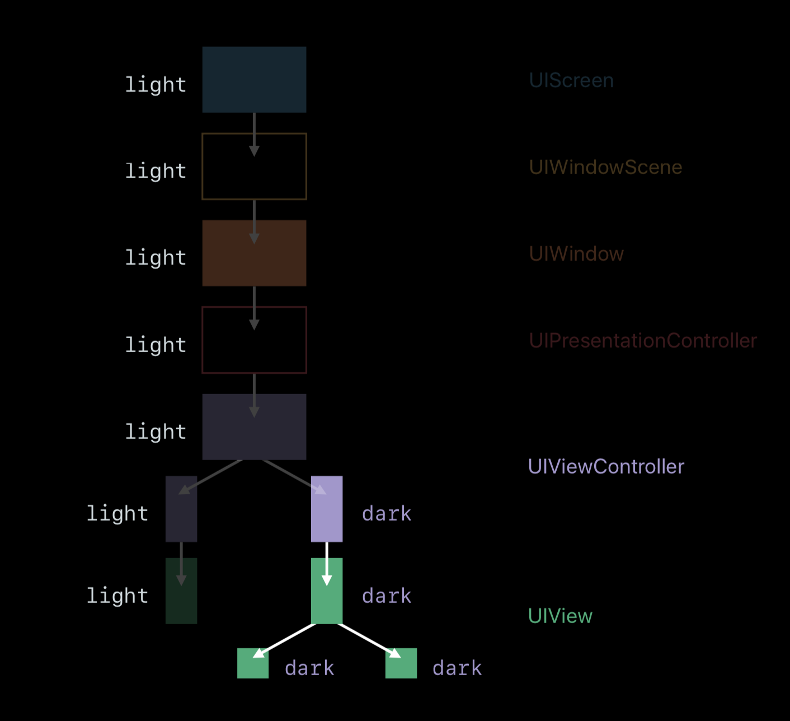
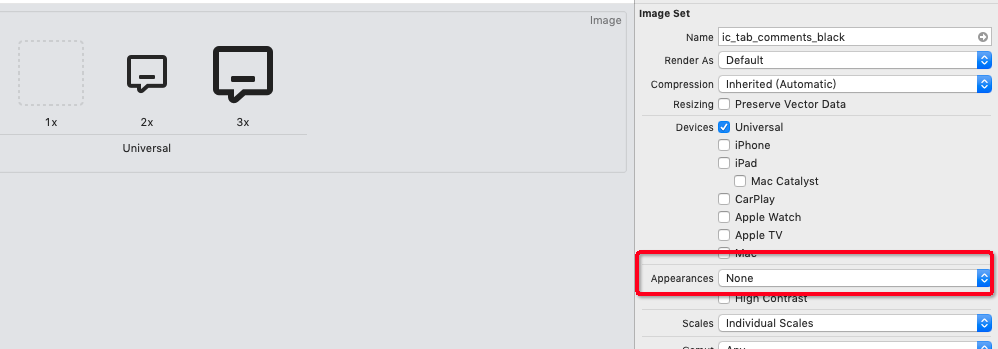
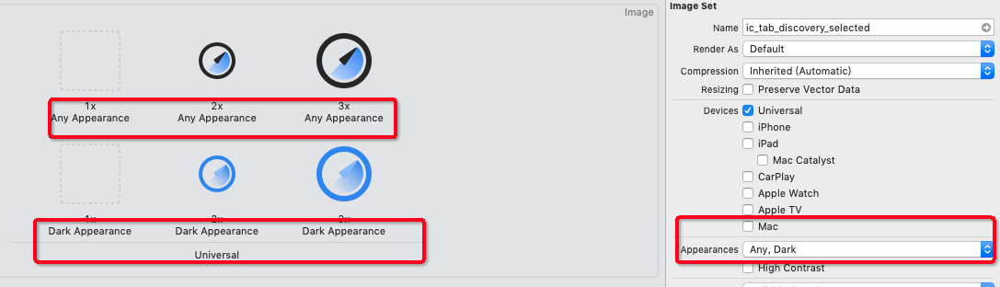

# iOS dark mode 适配

## 实现的基础

### 模式处理

####  当前模式

UI的模式存储在`UITraitCollection`中的`UIUserInterfaceStyle`

````swift
@available(iOS 12.0, *)
public enum UIUserInterfaceStyle : Int {
    case unspecified
    case light
    case dark
}
````

`View`以及`UIViewController`都实现了如下协议

````swift
@protocol UITraitEnvironment <NSObject>
@property (nonatomic, readonly) UITraitCollection *traitCollection API_AVAILABLE(ios(8.0));
- (void)traitCollectionDidChange:(nullable UITraitCollection *)previousTraitCollection API_AVAILABLE(ios(8.0));
@end
````

所以在这两个上下文中都可以直接拿到tratCollection，并且通过`traitCollectionDidChange`在trait发生变化时做自定义的响应。

#### 修改模式

`traitCollection`属性会从所属View或者ViewController继承。所以在不修改的情况下，一个完整的视图层级的trait是一致的，如果从某个节点修改，该节点往下的View会与该节点保持一致，大概如下图。



View以及ViewController都提供了修改的方式，并且是一致的

```
self.overrideUserInterfaceStyle = .dark
```

#### App模式开关处理

除了可以在系统中修改模式来改变样式，还允许用户在App内部设置模式来做修改

````swift
class UserPreferenceManager {
    
    @available(iOS 12.0, *)
    func getUserInterfaceStyle() -> UIUserInterfaceStyle{
        let intMode: Int = UserDefaultManager.object(forKey: UserDefaultsKeys.Settings.userInterfaceStyle, defaultValue: UIUserInterfaceStyle.unspecified.rawValue)
        return UIUserInterfaceStyle(rawValue: intMode) ?? .unspecified
    }
    
    @available(iOS 13.0, *)
    func setUserInterfaceStyle(style: UIUserInterfaceStyle) {
        UserDefaultManager.set(style.rawValue, forKey: UserDefaultsKeys.Settings.userInterfaceStyle)
        (UIApplication.shared.delegate as? AppDelegate)?.setUserInterfaceStyle(style)
    }
    
    //用户选择，则按照用户意愿，否则使用系统设置
    @available(iOS 12.0, *)
    func userfaceStyle(sysStyle: UIUserInterfaceStyle) -> UIUserInterfaceStyle {
        let userSelectedStyle = preference.getUserInterfaceStyle()
        return userSelectedStyle == .unspecified ? sysStyle : userSelectedStyle
    }
 }
````

将用户在App内的修改记录到UserDefault中，并且可以从中读取，第三个方法会根据传入的mode与用户设置综合考虑，来返回一个合适的mode。

### 颜色

#### 处理

颜色是适配的重点，官方提供了方便的方法来做处理

```swift
extension UIColor {
    @available(iOS 13.0, *)
    public init(dynamicProvider: @escaping (UITraitCollection) -> UIColor)    
    /* Resolve any color to its most fundamental form (a non-dynamic color) for a specific trait collection.
     */
    @available(iOS 13.0, *)
    open func resolvedColor(with traitCollection: UITraitCollection) -> UIColor
}
```

使用block的方式，根据不同的trait，返回不同的Color，这样，当系统mode变化时，系统会自动帮我们创建合适的颜色。

如下是我们对这个方法进行的包装。

```swift
static func dynamicColor(_ lightColor: UIColor, darkColor: UIColor) -> UIColor{
        if #available(iOS 13.0, *) {
            return UIColor { (trait) -> UIColor in
                if trait.userInterfaceStyle == .dark {
                    return darkColor
                }else {
                    return lightColor
                }
            }
        } else {
            return lightColor
        }
    }
```

可以通过这个方法方便的构建新的颜色体系

````swift
struct KrColor {
    //填充色
    struct Fill {
        static var bg: UIColor {
            return KrColor.dynamicColor(UIColor(hex: 0xFFFFFF),
                                        darkColor: UIColor(hex: 0x262626))
        }        
        static var card: UIColor {
            return KrColor.dynamicColor(UIColor(hex: 0xFAFAFA),
                                        darkColor: UIColor(hex: 0x3C3C3C))
        }        
        static var gap: UIColor {
            return KrColor.dynamicColor(UIColor(hex: 0xF8F9FA),
                                        darkColor: UIColor(hex: 0x202020))
        }        
        static var divider: UIColor {
            return KrColor.dynamicColor(UIColor(hex: 0x000000,alpha: 0.08),
                                        darkColor: UIColor(hex: 0xFFFFFF,alpha: 0.3))
        }
    }    
    //文字色
    struct Txt {
        static var title: UIColor {
            return KrColor.dynamicColor(UIColor(hex: 0x262626),
                                        darkColor: UIColor(hex: 0xFFFFFF))
        }        
        static var desc: UIColor {
            return KrColor.dynamicColor(UIColor(hex: 0x262626,alpha: 0.6),
                                        darkColor: UIColor(hex: 0xFFFFFF,alpha: 0.6))
        }        
        static var note: UIColor {
            return KrColor.dynamicColor(UIColor(hex: 0x262626,alpha: 0.4),
                                        darkColor: UIColor(hex: 0xFFFFFF,alpha: 0.4))
        }
    }    
}
````

#### 问题

像快讯，创投的cell用的是YYText，在响应变化上有些问题，针对这些问题需要做些额外处理。

当trait发生变化时，reloadTable，触发重新设置

```swift
override func traitCollectionDidChange(_ previousTraitCollection: UITraitCollection?) {
    super.traitCollectionDidChange(previousTraitCollection)
    tableView.reloadData()
}
```

这种处理，在通过系统设置修改mode时是会生效的，但是通过修改主Window的方式修改trait，却不会生效。

通过断点查看，从YYLabel到达Color创建方法时，给出的trait并不是window上的trait。估计YYLabel并不会接受父视图的trait。这时候，可以在创建Color的方法里加一些逻辑，综合传入的trait与App内设置的trait进行判断

````swift
static func dynamicColor(_ lightColor: UIColor, darkColor: UIColor) -> UIColor{
    if #available(iOS 13.0, *) {
        return UIColor { (trait) -> UIColor in
            if preference.userfaceStyle(sysStyle: trait.userInterfaceStyle) == .dark {
                return darkColor
            }else {
                return lightColor
            }
        }
    } else {
        return lightColor
    }
}
````

这样就可以使用准确的trait来创建color。

### 图标

#### 处理

之前的图标设置方式如下



当我们需要适配dark时，可以在Appearences中选择。



Appearences中选择Any，Dark，主界面多出了三个图片空位，我们将相应的icon添加上，当模式变化时，系统会创建新的icon填充，不需要我们额外处理。

#### 问题

tabbar上的icon却不会自动重绘，需要我们手动处理。处理起来不算复杂，有两处

1、在didChange通知方法中重置icon

```swift
override func traitCollectionDidChange(_ previousTraitCollection: UITraitCollection?) {
    super.traitCollectionDidChange(previousTraitCollection)
    resetTabbarIcon()
}
```

2、重置图片，根据traitCollection取对应图片来重新设置

```swift
func resetTabbarIcon() {
    func tabIconImage(name: String) -> UIImage?{
        return UIImage(named: name)?
            .imageAsset?
            .image(with: traitCollection)
    }
    newsTab.tabBarItem.image = tabIconImage(name: "ic_tab_home_normal")
    newsTab.tabBarItem.selectedImage = tabIconImage(name: "ic_tab_home_selected")
}
```


## 实施

有了上边这些基础，下面就开始就行繁琐的处理

### 色值处理

#### 文字颜色

设计给出了三种文字色值，定义如下

```swift
struct Txt {
    static var title: UIColor {
        return KrColor.dynamicColor(UIColor(hex: 0x262626),
                                    darkColor: UIColor(hex: 0xFFFFFF))
    }
    
    static var desc: UIColor {
        return KrColor.dynamicColor(UIColor(hex: 0x262626,alpha: 0.6),
                                    darkColor: UIColor(hex: 0xFFFFFF,alpha: 0.6))
    }
    
    static var note: UIColor {
        return KrColor.dynamicColor(UIColor(hex: 0x262626,alpha: 0.4),
                                    darkColor: UIColor(hex: 0xFFFFFF,alpha: 0.4))
    }
}
```

项目中的文字颜色也基本上是基于262626的，所以对alpha为0.4的262626进行全局搜索替换，匹配的时候，注意，只匹配textColor。然后依次处理，alpha为0.6的，以及为1的。替换完毕，大部分的View的主要字体颜色就处理完了。

#### 背景色

背景色有三种，还有一个线条颜色也放一起了，定义如下

````swift
struct Fill {
    static var bg: UIColor {
        return KrColor.dynamicColor(UIColor(hex: 0xFFFFFF),
                                    darkColor: UIColor(hex: 0x262626))
    }
    
    static var card: UIColor {
        return KrColor.dynamicColor(UIColor(hex: 0xFAFAFA),
                                    darkColor: UIColor(hex: 0x3C3C3C))
    }
    
    static var gap: UIColor {
        return KrColor.dynamicColor(UIColor(hex: 0xF8F9FA),
                                    darkColor: UIColor(hex: 0x202020))
    }
    
    static var divider: UIColor {
        return KrColor.dynamicColor(UIColor(hex: 0x000000,alpha: 0.08),
                                    darkColor: UIColor(hex: 0xFFFFFF,alpha: 0.3))
    }
}
````

背景类似字体，先对这四种颜色就行筛选和替换。

#### 查漏补缺

批量处理之后，还有大量颜色，但是对应的地方却很少，需要仔细处理。这些已经标注了使用场景，交给设计帮忙看看哪些可以通过新定义的颜色去替换，标注示例如下

````swift
//用的较多
//1 背景色，文字色
//0.8 文字色
//0.4 背景色（频道编辑页面模糊）
//0.36 文字色
//0.96 背景色
static var Color_FFFFFF: UIColor {
    return UIColor(hex: 0xffffff)
}

//0.04 背景 文字
//0.02 0.06 0.6 背景
//1 阴影
static var Color_000000: UIColor {
    return UIColor(hex: 0x000000)
}

//背景，导航栏底部分割线颜色
static var Color_F2F4F7: UIColor {
    return UIColor(hex: 0xF2F4F7)
}
````

设计会给该颜色是否可以使用新的设计替换，如果不可以，会给出相应的dark模式下的色值。


