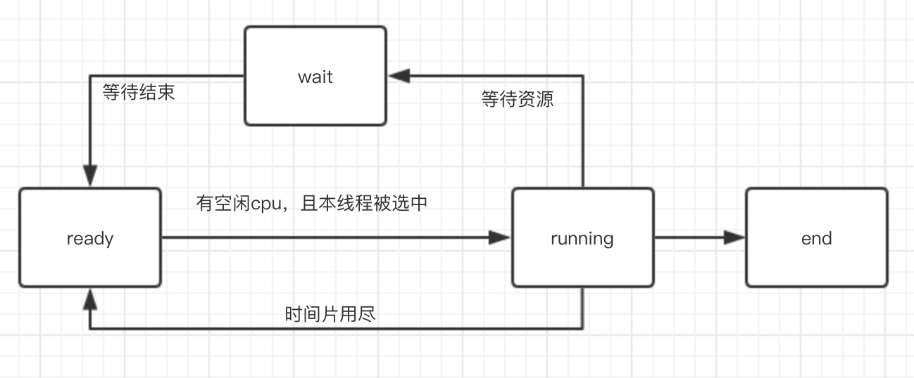

并发编程涉及到的概念：线程，队列，同步，异步，锁，临界区

### 线程

#### 简介

程序执行的最小单元，一个进程由多个线程组成，线程共享程序内存空间，以及进程资源。

线程有一些私有空间（数据不一致问题起源），栈，线程局部存储（TLS），寄存器。

用户线程和内核线程的关系

* 一对一模型
  * 有些操作系统限制内核线程数量，一对一模型会让用户线程数很受限制
  * 内核线程调度，上下文开销较大，导致用户线程执行效率低
* 多对一模型，解决了用户线程数量限制问题，以及切换开销但是由如下缺点
  * 一个用户线程阻塞，会导致内核线程阻塞，那么该内核线程对应的所有用户线程都会阻塞
* 多对多模型，解决了上边的几个问题


**问题：**

iOS，macOS 线程模型是多对多吗？

#### 调度 & 状态

线程有多个状态，ready，running，wait，end。



主流的现场调度各不相同，但是都有优先级调度以及轮转法的痕迹。轮转法就是让线程轮流执行一小段时间，而优先级调度，则决定了线程按照什么顺序轮流执行。线程从某个维度会有一些分类，比如频繁等待的线程被称为**IO密集型线程（IO Bound Thread）**，把很少等待的线程，称为**CPU密集型线程（CPU bound Thread）**。系统有时候会根据线程表现自动调节线程优先级，IO密集型线程因为经常因等待而让出CPU，所以更招系统喜爱，会调高优先级。

优先级调度下，存在一种饿死的现象。说的是一种低优先级线程，总得不到执行的情况。当一个CPU密集型线程获得较高优先级时，许多低优先级线程就可能饿死。而高优先级的IO密集型线程由于经常等待，让出cpu，所以不容易有饿死的现象。调度系统常常会提高那些等待时间较长的线程优先级，以避免饿死的情况。

**问题：**

unfair lock与线程优先级有什么关系？

线程优先级与加锁顺序的关系？

### iOS中的队列

队列分两种，串行队列，并发队列。iOS中默认有主队列，全局队列。开发者可以自己创建自己的队列。

串行队列执行完一个任务，才会执行下一个任务，串行执行。需要注意的是，串行队列只会保证串行，但是不会保证只用一个线程来执行，线程池应该是队列的下层封装，串行队列执行完当前任务，会从线程池申请线程执行下个任务。

并发队列多个线程会依次从队列中拿出任务执行。并发数与空闲线程有关，由GCD调度。
全局队列属于并发队列，由多个线程处理任务。主队列只有主线程来执行，所以是串行队列。

**主队列一度让我很迷惑，因为它给我的感觉是，所有用户的操作都被封装成了任务，添加到主队列中执行**，比如用户点击一个按钮，打开一个页面。被封装成一个任务，放到了主队列中。这样比较好解释在主线程异步分发主队列任务`DispatchQueue.main.async`。后来有人解惑，才知道主队列不同于一般的专门的队列。主队列的实现是通过runloop来实现的，如下代码。

````objective-c
else if (msg_is_dispatch) {
    __CFRUNLOOP_IS_SERVICING_THE_MAIN_DISPATCH_QUEUE__(msg);
 } 
````
这是runloop中`CFRunLoopRunSpecific `方法中的片段。如果收到dispatch消息。就会处理主队列中的任务。主线程承担事件分发处理，额外还会处理主队列中的任务。

### 同步&异步

同步执行会阻塞当前线程，等待同步任务执行完之后继续当前线程。异步执行，相当于构造一个任务扔到队列里。不会阻塞当前线程。
异步比较简单。同步会比较难理解一点，使用场景也比较少。毕竟同步执行，不如直接执行代码块。并且有些行为也和我们理解的不太一致。比如下面这个场景。
````swift
DispatchQueue.global().sync {
    print("global sync run in main")
}
````
这段代码比较简单，我以为是用block构建一个任务放到全局队列中，然后阻塞当前线程。用global队列中的线程执行该任务。
````swift
override func viewDidLoad() {        
    super.viewDidLoad()
    DispatchQueue.global().sync {
        print("current thread = \(Thread.current)")
    }
}
//输出
current thread = <NSThread: 0x14be0d200>{number = 1, name = main}
````
这里输出的是主线程，这里的代码，和直接调用print可以说没有区别。
仔细看`sync`方法的文档，里面有这样一句话
> As an optimization, this function invokes the block on the current thread when possible.

如果可能的话，block会在当前线程中执行。上面例子中就是在当前线程中执行。下面在看个例子。
````swift
override func viewDidLoad() {
    super.viewDidLoad()
    DispatchQueue.global().async {
        print("print aaaaasync,thread: \(Thread.current)")
    }
    DispatchQueue.global().async {
        print("print aaaaasync,thread: \(Thread.current)")
    }
    DispatchQueue.global().async {
        print("print aaaaasync,thread: \(Thread.current)")
    }
    DispatchQueue.global().sync {
        print("print ssssssync,thread: \(Thread.current)")
    }
}
//输出
print ssssssync,thread: <NSThread: 0x106516640>{number = 1, name = main}
print aaaaasync,thread: <NSThread: 0x1094324e0>{number = 11, name = (null)}
print aaaaasync,thread: <NSThread: 0x10971ed40>{number = 12, name = (null)}
print aaaaasync,thread: <NSThread: 0x10971ed40>{number = 12, name = (null)}
````
这里在`sync`执行前，已经通过`async`在队列里放置了三个任务。但`sync`执行的时候，仍然是直接执行了，`async`先放进去的任务后续执行。按照队列的逻辑，这就不太说的通了，毕竟先进的还没拿出来，后进的先出了。这里猜测，可优化的情况下，sync执行的任务，根本没有放在global的queue中。而是直接在当前线程中执行了。
所以一开始给的说明要补充一点例外情况：
同步执行会阻塞当前线程，等待同步任务执行完之后继续当前线程。异步执行，相当于构造一个任务扔到队列里。不会阻塞当前线程。非主队列在主线程同步执行，会直接由主线程执行。

````swift
override func viewDidLoad() {
    super.viewDidLoad()
    let serial = DispatchQueue(label: "serial")
    serial.async {
        print("print serial async: \(Thread.current)")
    }
    serial.sync {
        print("print ssssssync,thread: \(Thread.current)")
    }
    serial.async {
        print("print serial async after: \(Thread.current)")
    }
}
//输出
print serial async: <NSThread: 0x1549134b0>{number = 10, name = (null)}
print ssssssync,thread: <NSThread: 0x14df06270>{number = 1, name = main}
print serial async after: <NSThread: 0x154913900>{number = 11, name = (null)}
````
这里的输出也很费解。按照上个结论，sync会直接在主线程执行，但是这里没有。这里是按照队列顺序执行。这个输出也说明了一个问题，队列和线程没有强绑定关系。串行队列不一定只有一个线程来执行，与当前空闲线程有关，但是会遵守串行的约定。队列应该是线程池之上的一套逻辑，队列决定哪些任务需要执行，然后将任务交给线程池，线程池决定用那个线程来处理该任务。

### 并发编程的问题

并发编程有很多好处，合理使用多核CPU，合理分配不同优先级的任务。但是并发带来的问题也很令人头疼。
线程一般不是直接操作内存中的数据，而是先读取到线程内部，然后操作，操作完写回内存。
当多个线程同时对一个变量进行操作时，就容易出现问题，
比如一个典型的问题，一百个线程，对同一个变量进行加一操作，假设原值是1，一百个线程跑完后，这个变量的值会小于100，没法准确知道会是多少。
要处理这个问题就需要做同步处理。保证读取到回写中间，不会有其他线程同时读写。

### 临界区（Critical section）

在同步的程序设计中，**临界区块**（Critical section）指的是一个访问共享资源（例如：共享设备或是共享存储器）的程序片段，而这些共享资源又无法同时被多个线程访问的特性。
对于开发来说，临界区就是一些对共享变量操作的代码块或者方法。这些方法如果同时被多个线程访问，就会出现一些不可预知的情况。如上面所说的例子，如果我们的方法是对一个共享变量做+1操作。那多个线程同时访问，是无法预知最后结果的。所以对于临界区的访问，需要用同步的方式。

### 线程同步的方式

##### `synchronized` 关键字
Objective-C使用，swift不可用。用于同步代码块，或者方法同步。多个线程会逐个进入。允许同个线程重入。
##### `objc_sync_enter` &  `objc_sync_exit`
对这两行代码中间的逻辑加同步。Swift使用，Objective-C中`synchronized `关键字依托这个实现。

##### dispatch_semaphore 信号量

信号量可以用来表示可用资源。`dispatch_semaphore_create(2); `比如这里的创建方法。要求传入一个Int值，表示创建的这个信号量表示多少资源。
每当一个资源被使用的时候，就调用`dispatch_semaphore_wait `方法，当有空闲资源时，这个方法会将资源数减一。没有空闲资源时，这个方法会阻塞当前的线程，当有空闲资源时，会继续执行。
当一个资源用完，释放时，就调用`dispatch_semaphore_signal`方法，资源数就会+1，表示多一个资源可用。

将资源数设置成1，就可以达成类似`synchronized `的效果。

##### 互斥量（Mutex）

和二元信号量很类似，资源仅同时允许一个线程访问，但和信号量不同的是，信号量在整个系统可以被任意线程获取并释放，而互斥量则要求哪个线程获取了互斥量，拿个线程负责释放，其他线程无法插手。

##### 锁
iOS关于锁有个协议
````swift
public protocol NSLocking {
    public func lock()
    public func unlock()
}
````
定义了最基本的操作，加锁和解锁，使用上类似`objc_sync_enter` &  `objc_sync_exit`，将需要同步访问的代码放到枷锁和解锁中间即可。
锁的具体实现有三个，NSLock、NSConditionLock、NSRecursiveLock。
##### NSLock
提供最基本的同步访问功能。使用比较简单
````objective-c
BOOL moreToDo = YES;
NSLock *theLock = [[NSLock alloc] init];
while (moreToDo) {
    /* Do another increment of calculation */
    /* until there’s no more to do. */
    if ([theLock tryLock]) {
        /* Update display used by all threads. */
        [theLock unlock];
    }
}
````
##### NSRecursiveLock

提供了可重入式的锁，允许同一个线程多次lock。这在递归调用上很有必要，名字也很明显，直译就叫递归锁。
````objective-c
NSRecursiveLock *theLock = [[NSRecursiveLock alloc] init];
void MyRecursiveFunction(int value)
{
    [theLock lock];
    if (value != 0)
    {
        --value;
        MyRecursiveFunction(value);
    }
    [theLock unlock];
}
MyRecursiveFunction(5);
````
##### NSConditionLock

条件锁用于处理一些有依赖的情况，例如生产者，消费者模型。
````objective-c
id condLock = [[NSConditionLock alloc] initWithCondition:NO_DATA];
while(true)
{
    [condLock lock];
    /* Add data to the queue. *///生产
    [condLock unlockWithCondition:HAS_DATA];
}
````
先无条件上锁，生产，将数据添加到队列，解锁并添加条件HAS_DATA。
````objective-c
while (true)
{
    [condLock lockWhenCondition:HAS_DATA];
    /* Remove data from the queue. */
    [condLock unlockWithCondition:(isEmpty ? NO_DATA : HAS_DATA)];
    // Process the data locally.
}
````
消费者用HAS_DATA条件解锁，如果当前的条件不是HAS_DATA，这里就会等待。生产者添加完数据，把条件设置成HAS_DATA之后，这里就会开始执行。执行完解锁，设置条件。如果还有数据，条件就是HAS_DATA，这样下个循环继续加锁，消费。如果这里数据用完了，就设置条件NO_DATA。下次循环就会等待，因为解锁的条件是HAS_DATA，不等于NO_DATA。

##### 非公平锁


##### 读写锁

对于同一个锁，读写锁有两种获取方式，**共享的（shared）**，**独占的（Exclusive）**。当锁处于自由状态，任何方式的加锁都能成功，如果锁处于共享状态，其他线程仍可以以共享的方式获取锁，但是如果有线程希望以独占的方式访问，就需要等待所有的共享锁释放。


**问题：**

条件锁是不是和信号量类似，可以由一个线程加锁，另一个线程解锁。NSLock则不可以这样处理

> Warning: The NSLock class uses POSIX threads to implement its locking behavior. When sending an unlock message to an NSLock object, you must be sure that message is sent from the same thread that sent the initial lock message. Unlocking a lock from a different thread can result in undefined behavior.


### 线程调度


参考：
https://developer.apple.com/library/archive/documentation/Cocoa/Conceptual/Multithreading/ThreadSafety/ThreadSafety.html#//apple_ref/doc/uid/10000057i-CH8-SW4