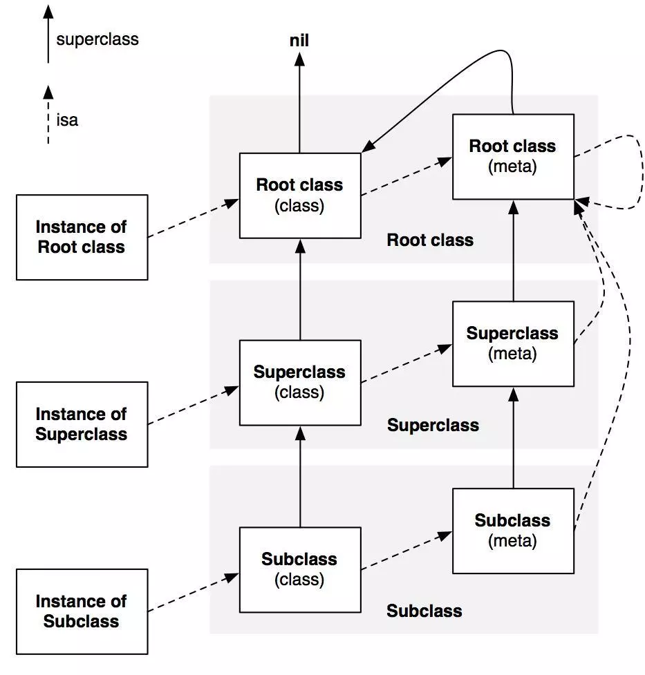

# runtime

## 简介

Runtime其实有两个版本: “modern” 和 “legacy”。我们现在用的 Objective-C 2.0 采用的是现行 (Modern) 版的 Runtime 系统，只能运行在 iOS 和 macOS 10.5 之后的 64 位程序中。而 maxOS 较老的32位程序仍采用 Objective-C 1 中的（早期）Legacy 版本的 Runtime 系统。这两个版本最大的区别在于当你更改一个类的实例变量的布局时，在早期版本中你需要重新编译它的子类，而现行版就不需要。


## 初始化流程


## 类与元类


## 元编程

创建类，并生成实例

修改替换方法的实现（hook）


## 数据结构

Runtime中的数据结构，起点为`objc_object`。`objc_object`是结构体类型，内部有一个属性，`isa_t`类型的`isa`。

````c
struct objc_object {
    Class isa  OBJC_ISA_AVAILABILITY;
};
````

`objc_object`只有一个属性，关于这个属性的介绍可以看这里[iOS内存介绍](../iOS内存介绍/readme.md)，这个属性里有两部分，大部分是记录内存相关，引用计数，弱引用，引用表之类，另一部分则是记录类信息或者元类信息。下面先介绍部分class相关信息然后继续介绍isa中元类相关操作。

`objc_class`是`objc_object`的子类

```c
struct objc_class : objc_object {
    // Class ISA;
    Class superclass;
    cache_t cache;             // formerly cache pointer and vtable
    class_data_bits_t bits;    // class_rw_t * plus custom rr/alloc flags

    class_rw_t *data() { 
        return bits.data();
    }
  ....
 }
```

`objc_class`相比`objc_object`多了bits属性，类型为`class_data_bits_t`。可以从该属性中拿到class_rw_t

```c
struct class_rw_t {
    uint32_t flags;
    uint32_t version;

    const class_ro_t *ro;

    method_array_t methods;
    property_array_t properties;
    protocol_array_t protocols;

    Class firstSubclass;
    Class nextSiblingClass;

    char *demangledName;
};
```

这里的method，properties，protocols都是在分类中的。class_rw_t中的ro属性中存的则是原类中的信息。从名字大概也可以看出来，rw = read & write，可读写，ro则是read only，只读。

```c
struct class_ro_t {
    uint32_t flags;
    uint32_t instanceStart;
    uint32_t instanceSize;
#ifdef __LP64__
    uint32_t reserved;
#endif

    const uint8_t * ivarLayout;
    
    const char * name;
    method_list_t * baseMethodList;
    protocol_list_t * baseProtocols;
    const ivar_list_t * ivars;

    const uint8_t * weakIvarLayout;
    property_list_t *baseProperties;

    method_list_t *baseMethods() const {
        return baseMethodList;
    }
};
```

## 类 & 元类

```c++
inline Class 
objc_object::ISA() 
{
    assert(!isTaggedPointer()); 
    return (Class)(isa.bits & ISA_MASK);
}
```

`ISA()`方法从isa数据中通过`ISA_MASK`取其中的地址部分信息。将该地址强转成Class信息。getIsa()方法则是在ISA()方法之上对TaggedPointer类型做了兼融。

```c++
inline Class 
objc_object::getIsa() 
{
    if (isTaggedPointer()) {
        uintptr_t slot = ((uintptr_t)this >> TAG_SLOT_SHIFT) & TAG_SLOT_MASK;
        return objc_tag_classes[slot];
    }
    return ISA();
}
```

isClass方法，对taggedPointer直接返回false，普通对象，则先通过ISA()获取class信息，在从class信息中取是否是元类。为什么对isClass的请求，要返回isMetaClass？

```c++
inline bool
objc_object::isClass()
{
    if (isTaggedPointer()) return false;
    return ISA()->isMetaClass();
}
```

objc_class中关于元类的几个方法实现

````c++
//objc_class结构体中的方法
//是否是元类，存在ro中
bool isMetaClass() {
    assert(this);
    assert(isRealized());
    return data()->ro->flags & RO_META;
}

// NOT identical to this->ISA when this is a metaclass
//如果本身就是元类，就返回自己，否则取isa（指向的元类）
Class getMeta() {
    if (isMetaClass()) return (Class)this;
    else return this->ISA();
}
//superclass为nil时，自己就是跟类
bool isRootClass() {
    return superclass == nil;
}
//元类和自己一样，就是根元类
bool isRootMetaclass() {
    return ISA() == (Class)this;
}
````

NSObject中类信息

````c++
+ (Class)class {
    return self;
}

- (Class)class {
    return object_getClass(self);
}
//最终调用的是ISA()方法
Class object_getClass(id obj){
    if (obj) return obj->getIsa();
    else return Nil;
}
````

下面这张图大部分都可以由上边代码说明，只有一个，Root class（meta）的superclass指向Root class（class），这个还需要继续了解



上图[来源](<http://sealiesoftware.com/blog/archive/2009/04/14/objc_explain_Classes_and_metaclasses.html>)，下面是原文

>Objective-C is a class-based object system. Each object is an instance of some class; the object's `isa` pointer points to its class. That class describes the object's data: allocation size and ivar types and layout. The class also describes the object's behavior: the selectors it responds to and instance methods it implements.
>
>The class's method list is the set of instance methods, the selectors that the object responds to. When you send a message to an instance, `objc_msgSend()` looks through the method list of that object's class (and superclasses, if any) to decide what method to call.
>
>Each Objective-C class is also an object. It has an `isa` pointer and other data, and can respond to selectors. When you call a "class method" like `[NSObject alloc]`, you are actually sending a message to that class object.
>
>Since a class is an object, it must be an instance of some other class: a metaclass. The metaclass is the description of the class object, just like the class is the description of ordinary instances. In particular, the metaclass's method list is the class methods: the selectors that the class object responds to. When you send a message to a class - an instance of a metaclass - `objc_msgSend()` looks through the method list of the metaclass (and its superclasses, if any) to decide what method to call. Class methods are described by the metaclass on behalf of the class object, just like instance methods are described by the class on behalf of the instance objects.
>
>What about the metaclass? Is it metaclasses all the way down? No. A metaclass is an instance of the root class's metaclass; the root metaclass is itself an instance of the root metaclass. The `isa` chain ends in a cycle here: instance to class to metaclass to root metaclass to itself. The behavior of metaclass `isa` pointers rarely matters, since in the real world nobody sends messages to metaclass objects.
>
>More important is the superclass of a metaclass. The metaclass's superclass chain parallels the class's superclass chain, so class methods are inherited in parallel with instance methods. And the root metaclass's superclass is the root class, so each class object responds to the root class's instance methods. In the end, a class object is an instance of (a subclass of) the root class, just like any other object.
>
>Confused? The diagram may help. Remember, when a message is sent to any object, the method lookup starts with that object's `isa` pointer, then continues up the superclass chain. "Instance methods" are defined by the class, and "class methods" are defined by the metaclass plus the root (non-meta) class.
>
>In proper computer science language theory, a class and metaclass hierarchy can be more free-form, with deeper metaclass chains and multiple classes instantiated from any single metaclass. Objective-C uses metaclasses for practical goals like class methods, but otherwise tends to hide metaclasses. For example, `[NSObject class]` is identical to `[NSObject self]`, even though in formal terms it ought to return the metaclass that `NSObject->isa` points to. The Objective-C language is a set of practical compromises; here it limits the class schema before it gets too, well, *meta*.

## 初始化流程

+load +initialize


## 相关应用

### KVO，KVC


### 方法转发


### 方法替换


疑问：

1、实例，类，元类图中，Root class（meta）的superclass指向Root class（class）这条线是如何得出的？

2、为什么对isClass的请求，要返回isMetaClass？


参考：

<http://yulingtianxia.com/blog/2014/11/05/objective-c-runtime/>

