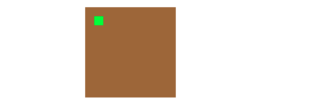
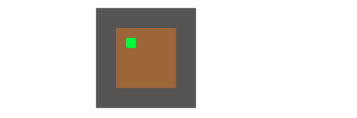
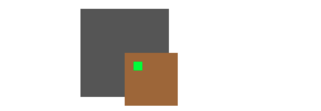
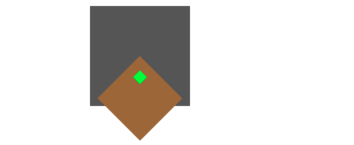
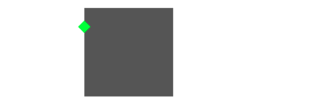
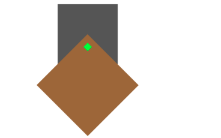
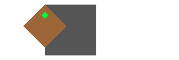
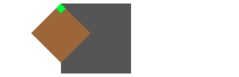

#  坐标与布局

UIView的frame，bounds，center基本都是来自layer的frame，bounds，position。下面介绍下layer层。

官方文档对layer的frame介绍

> The frame rectangle is position and size of the layer specified in the superlayer’s coordinate space. For layers, the frame rectangle is a computed property that is derived from the values in the[bounds](apple-reference-documentation://hs1scbMgi0), [anchorPoint](apple-reference-documentation://hsLKrJbnXz) and [position](apple-reference-documentation://hsxpfBafgD) properties. When you assign a new value to this property, the layer changes its [position](apple-reference-documentation://hsxpfBafgD)and [bounds](apple-reference-documentation://hs1scbMgi0) properties to match the rectangle you specified. The values of each coordinate in the rectangle are measured in points.

大概是说，frame表示layer在父layer坐标系中的位置和大小。frame是计算属性，根据bounds，anchorPoint和position来计算。设置frame，会修改position和bounds。以point为单位。

构建一个简单的场景，backView，testView，innerView

```swift
backView.frame = CGRect(x: 100, y: 100, width: 100, height: 100)
backView.backgroundColor = .darkGray
view.addSubview(backView)

testView.frame = CGRect(x: 100, y: 100, width: 100, height: 100)
testView.backgroundColor = .brown
view.addSubview(testView)

innerView.frame = CGRect(x: 10, y: 10, width: 10, height: 10)
innerView.backgroundColor = .green
testView.addSubview(innerView)

//print layer
testView.layer.frame   :(100.0, 100.0, 100.0, 100.0)
testView.layer.bounds  :(0.0, 0.0, 100.0, 100.0)
testView.layer.position:(150.0, 150.0)
```



修改下bounds的size。

````swift
testView.bounds = CGRect(x: 0, y: 0, width: 60, height: 60)

//print layer
testView.layer.frame   :(120.0, 120.0, 60.0, 60.0)
testView.layer.bounds  :(0.0, 0.0, 60.0, 60.0)
testView.layer.position:(150.0, 150.0)
````



修改了bounds中的size，frame的origin和size都发生了变化。这和只更改frame中的size是不同的。大概可以得出

```
frame.origin.x = position.x - 0.5*bounds.size.width
frame.origin.y = position.y - 0.5*bounds.size.height
frame.width = bounds.size.width
frame.height = bounds.size.height
```


下面修改下anchorPoint来看看

````swift
testView.layer.anchorPoint = CGPoint(x: 0, y: 0)

//print layer
testView.layer.frame   :(150.0, 150.0, 60.0, 60.0)
testView.layer.bounds  :(0.0, 0.0, 60.0, 60.0)
testView.layer.position:(150.0, 150.0)
````



frame再次发生了变化。上边得到的结论不适用了？不是不适用了，而是上边的0.5，其实是anchorPoint的默认值。如果把0.5换成anchorPoint，如下，那依然适用。

````swift
frame.origin.x = position.x - anchorPoint.x * bounds.size.width  
frame.origin.y = position.y - anchorPoint.y * bounds.size.height
frame.width = bounds.size.width
frame.height = bounds.size.height
````

可以看到，确实如文档所说，frame是由position，bounds（只取size），anchorPoint决定。


在计算过程中会有一个奇怪的感觉，anchorPoint和position有某种关联。当anchorPoint为(0.5,0.5)时，表示anchorPoint在中间。这个时候position也是在中间位置。当anchorPoint为(0,0)时，表示在左上角，position这个时候也是在左上角，可以说position就是anchorPoint在layer中的坐标位置。


至此这些属性都算挂上了钩，一个矩形从几何学上考虑，需要两个关键信息：位置(position)，大小(size)。对一个layer来说，size当然就是bounds的size，而position其实是由layer.position和layer.anchorPoint决定。

如果不考虑对这个矩形进行操作，其实anchorPoint是没用的，固定为（0.5，0.5）可以简化很多计算。但是那样对矩形的操作就缺少了很多自由。anchorPoint名字非常有说明性，锚点，这是一个固定的点。当涉及到旋转的时候，围绕着中点转符合大部分场景，但是如果想实现，类似钟表里的指针旋转，修改锚点就是一个绝佳的方案。

旋转操作其实对于frame的影响很大。frame是一个中规中矩的矩阵，不会斜着放。所以，当一个view发生旋转时，虽然bounds没有变化，但是frame却不会相同。我们添加一个旋转45度角

````swift
testView.transform = CGAffineTransform(rotationAngle: CGFloat.pi/4)

//print layer
testView.layer.frame   :(107.57359312880715, 150.0, 84.8528137423857, 84.8528137423857)
testView.layer.bounds  :(0.0, 0.0, 60.0, 60.0)
testView.layer.position:(150.0, 150.0)
````



testView以(150,150)为锚点，转了45度。虽然这里可以打印出frame，并且我们其实也可以根据转角计算出当前的frame，但是官方已经不建议使用旋转之后的frame了。

> Do not set the frame if the [transform](apple-reference-documentation://hsxsl3Ynbw)property applies a rotation transform that is not a multiple of 90 degrees.

不建议在操作frame，我们可以试一下看看效果。在进行transform之后重新对frame进行设置

````swift
testView.frame = CGRect(x: 100, y: 100, width: 100, height: 100)

//print layer
testView.layer.frame      :(99.99999999999999, 100.0, 100.00000000000001, 100.0)
testView.layer.bounds     :(0.0, 0.0, 141.4213562373095, 1.4210854715202004e-14)
testView.layer.position   :(100.0, 100.0)
````



这时已经看不到testView了，并且innerView的位置也是很令人费解。打印出来的位置属性也非常奇怪。

那这个时候我们如何操作呢，官方建议通过position和bounds进行操作。比如放大一点

````swift
testView.bounds = CGRect(x: 0, y: 0, width: 120, height: 120)

//print layer
testView.layer.frame      :(65.14718625761431, 150.0, 169.7056274847714, 169.7056274847714)
testView.layer.bounds     :(0.0, 0.0, 120.0, 120.0)
testView.layer.position   :(150.0, 150.0)
testView.layer.anchorPoint:(0.0, 0.0)
````



往左上角移动（50，50）

````swift
testView.layer.position = CGPoint(x: 100, y: 100)
````



这些操作还是很符合预期的。


进行的差不多了，还有一个值，我们没有修改过，下面在来玩一下。修改bounds的size的同时，修改一下x和y

````swift
testView.layer.bounds = CGRect(x: 10, y: 10, width: 60, height: 60)
````



innerView发生了变化。所以bounds属性其实是修改当前view的展示区域。如果testView非常大，超过屏幕好多，然后通过PanGesture操作bounds的x，y，就是一个简化版的scrollView！


下面是在了解这些属性之前的一些疑问，现在可以一一作答了

1、layer中frame，position，anchorPoint，bounds的关系

frame由position，bounds，anchorPoint计算得出。position和anchorPoint是对应的关系。

2、anchpointer，在什么情况下使用

当不希望以中心为锚点来旋转时，可以更改anchorPoint。

3、坐标系统中哪些是存储属性，哪些是计算属性（x,y,center,origin,frame），换种问法，哪些是坐标的决定因素

position，anchorPoint，bounds中的size，这些是当前坐标中的决定因素

4、仿射变换后，frame的变化

仿射变换后，frame也会进行变化，frame是可以包裹住当前bounds的最小矩形。可以根据转角计算得出。

5、UIView的frame与Layer的frame

UIView的frame与layer的frame是对应的，并且UIView中的center跟Layer中的Position也是对应的。


参考：

<https://oleb.net/blog/2014/04/understanding-uiscrollview/>

<https://medium.com/@suragch/frame-vs-bounds-in-ios-107990ad53ee>