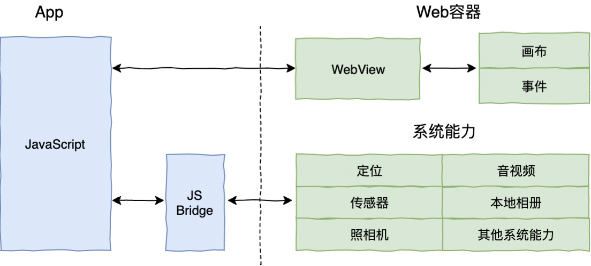
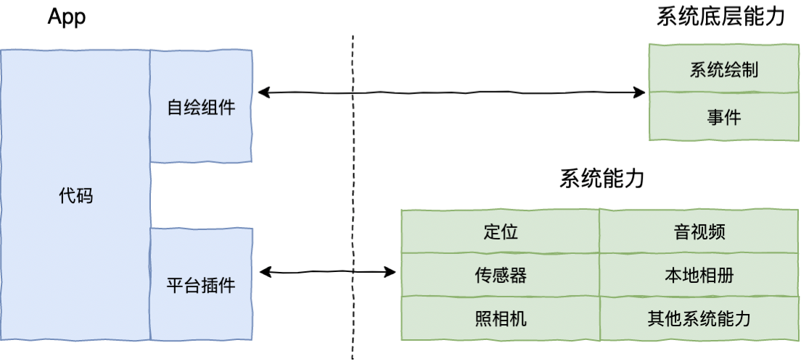

# 跨平台技术

## 三个阶段

**Web 容器时代**

基于 Web 相关技术通过浏览器组件来 实现界面及功能，典型的框架包括 Cordova(PhoneGap)、Ionic 和微信小程序。 

**泛 Web 容器时代**

能否 对笨重的 Web 容器进行功能裁剪，在仅保留必要的 Web 标准和渲染能力的基础上，使得友好的开发体验与稳定的渲染性能保持一个平衡?

采用类 Web 标准进行开发，但在运行时把绘制和渲染交由原生系统接管的技术，代表框架有 React Native、Weex 和快应用，广义的还包括天猫的 Virtual View 等。 

**自绘引擎时代**

自带渲染引擎，客户端仅提供一块画布即 可获得从业务逻辑到功能呈现的多端高度一致的渲染体 验。Flutter，是为数不多的代表。

## flutter

视图层级的结构与渲染

视图布局

多页面组织与跳转

资源管理&包管理

事件响应

手势

Dart

JIT（Just In Time，即时编译） & AOT（Ahead of Time，运行前编译）

使用垃圾回收机制（多生代算法）

单线程模型，使用Isolate实现并发，通过事件循环(Event Looper)在事件队列(Event Queue)上传递消息通信。

面向对象，顶层类型Object

支持范型

除了基础类型（bool，num，string，list，map）都是对象，包括func，可以用于传参

函数不支持重载，支持可选命名参数，参数默认值

访问权限，private（库内访问），public（全局访问），用下划线标示private

没有protocol或者interface概念，可以对类进行继承或者实现，继承就是常规逻辑，实现则表示，将此类当成协议来看待，忽略其实现，只关注方法签名。

通过混入（Mixin）来实现多继承

支持可选类型类似Swift中的optional，但是稍有不同

支持覆写

支持try catch处理错误

参考

https://juejin.im/post/5d6378c45188257e197344c6

https://juejin.im/post/5b098c87f265da0ddd7c92f9?utm_source=gold_browser_extension

<https://zhuanlan.zhihu.com/flutter>