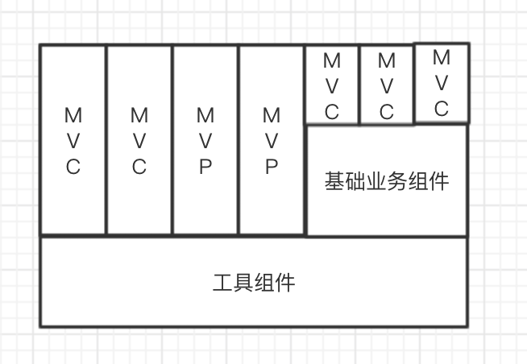

# 组织模式

一个App一般会有一些基础工具组件，业务相关组件。然后使用这些工具，来处理一些业务。一个简单的业务可以由一套MVC代码来处理，复杂点的业务模块由一组MVC构成。大致如下图。MVC也可以换成MVVM，MVP。

常说的MVC，MVVM，MVP，处理的大概是这些小的视觉相关的业务模块。通常一个这样的业务模块包含如下逻辑

1、 接收用户操作

2、业务逻辑处理

3、网络请求

4、数据解析验证处理

5、格式化成View需要的数据

6、数据存储

7、视图布局渲染

8、路由

所以不管是用哪种模式，总要将上述的逻辑，分配到某个位置。

### MVC

上述8个逻辑，在MVC里，View层一般包括视图的7，也可以包含5（如果不打算复用view，或者view跟model强绑定没关系的话。）。model层，如果采用胖model的设计，则可以包括3，4，6，如果是瘦model的设计的话，这三个都不算，model只是一个对字典的包装。

### 依赖关系

#### MVC

iOS 中的MVC，controller持有跟View，所以Controller是依赖view的。而view与model是通过controller进行的关联，所以，controller也依赖Model，model和view对外没有依赖关系。可以被任意复用。

但是在实际使用中，很多业务中，没有必要对view和model进行解耦，所以，controller会直接将model交给view处理，可以节省controller中一些逻辑。这种情况下，增加了view对model的依赖。只有model对外没有依赖关系，可以任意复用。

参考：

<https://www.youtube.com/watch?v=qzTeyxIW_ow>

<https://blog.walterlv.com/post/mvvm-do-and-dont.html>