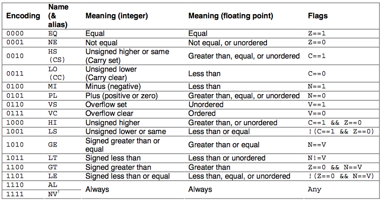
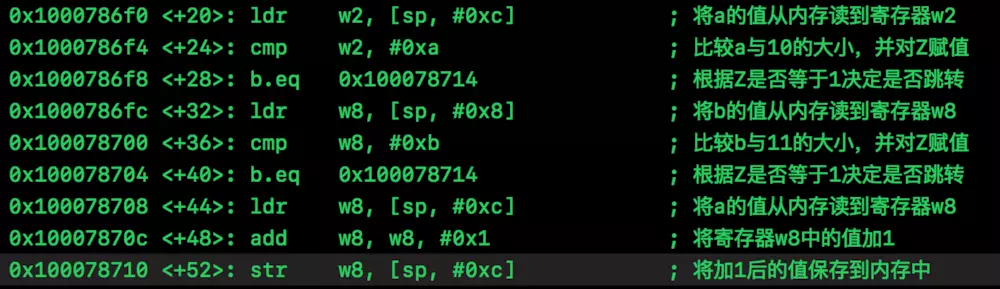

之前读了汇编语言的书，了解了一些概念。但是打开OC文件的汇编代码，发现出入还是很大的。花了些时间了解了下。下面做些记录。

总体结构：
````
一. iOS 平台的CPU架构
二. 主要概念
      1. 寄存器
      2. 栈
      3. 指令
          * 运算（算数，逻辑，拓展位）
          * 寻址
          * 跳转
三. 汇编代码文件的组织形式和构成
      1. 段
      2. 方法

四. 代码讲解
````


###iOS平台使用的CPU
`armv6`  ：iPhone3G以及之前的设备，iPod Touch 一代和二代。
`armv7`  ：iPhone4s以及之前的设备，iPad，iPad2
`armv7s`：iPhone5、iPhone5C
`arm64`：除以上设备
所以下，接下来主要了解arm64架构下的指令与使用。


### 主要概念
汇编语言的主要操作，是从内存中读取数据到寄存器，对寄存器中的数据进行处理，在写回内存中。内存主要以栈的形式访问。下面看看寄存器，栈以及相关指令。
#### 寄存器
iOS寄存器比x86_64多很多。
##### 通用寄存器
`R0 - R28` 29个整形寄存器，可以分两种访问形式。用`x0 - x30`访问时，是完整寄存器访问。用`w0 - w30`访问时，当成32位寄存器使用，只访问低32位。 `R29 - R31`存储特殊数据。
`V0 - V31` 向量寄存器，128位大小。可以分别按照8位，16位，32位，64位，128位访问，访问名`Bn Hn Sn Dn Qn`。缩写介绍：`B = Byte ` `H = half` `S = Single` `Q = quad`

##### 特殊寄存器，存储在这些寄存器中的数据被赋予一定的意义
* 程序计数器 `PC`，保存当前CPU执行指令的地址。
* `x31` 用作 `zero register` ，也叫 `ZR` 符合上述所说的，`XZR/WZR` 分别访问64位和低32位。
* `x31` 代表SP寄存器，类似的，`WSP`访问低32位。
* FP，即x29，存放栈底指针。
* `SPRs` 状态寄存器： 一些比较指令是没有返回值的，而是把比较结果放在状态寄存器里。
* `LR`，即x30， `link register` 记录调用者的位置，被调用者执行完毕后，通过`LR`回到之前的位置。
* 状态寄存器，按位存放状态，控制代码的分支执行。（实现`if`功能）
> 说明：`x31`不会直接使用，用xzr访问时，用作`zero register`。用`SP`访问时，用作栈寄存器。

#### 栈
指令的执行需要存放临时变量。会申请一块内存，按照栈的结构来使用。有两个寄存器来记录栈的使用情况。
`FP` 指向栈底，`SP` 指向栈顶。每个方法会有一个栈模型。申请栈的大小与方法中使用的变量数，以及变量长度有关。
#### 指令
指令可以粗略的分为运算，寻址与跳转。运算又可以分为算数运算，逻辑运算，拓展位运算。
##### 运算
**算数运算**
算数运算指令比较好理解，加减乘除（ADD，SUB，MUL），基本都是英文缩写。
````
add x0, x1, x2; // 把 x1 + x2 = x0 这样一个操作。
sub sp, sp, 0x30; // 把 sp - 30 存入sp.
cmp x11, #4;  // 相当于 subs xzr, x11, #4.  
              // 如果 x11 - 4 == 0, 那么状态寄存器NZCV.Z = 1
              // 如果 x11 - 4 < 0, 那么 NZCV.N = 1
````
运算指令会将一些状态存储到状态寄存器（状态寄存器是什么？）上。常见的状态值：`N Z C V`
* N, negative condition flag，一般代表运算结果是负数 
* Z, zero condition flag, 运算结果为0 
* C, carry condition flag, 无符号运算有溢出时，C=1。 
* V, oVerflow condition flag 有符号运算有溢出时，V=1。 

**逻辑运算**
有 `LSL`(逻辑左移) `LSR`(逻辑右移) `ASR`(算术右移) `ROR`(循环右移)。 
有 `AND`(与) `ORR`(或) `EOR` (异或)
逻辑运算和移位运算可以组合使用。如下
`add  x14, x4, x27, lsl #1; // 意思是把  (x27 << 1) + x4 = x14; `
**拓展位运算**
有 `zero extend`(高位补0) 和`sign extend`(高位填充和符号位一致，一般有符号数用这个)。 一般用来补齐位数。常和算术运算配合一起.如：
`add        w20, w30, w20, uxth  // 取 w20的低16位，无符号补齐到32位后再进行  w30 + w20的运算。`

##### 寻址
`load` 系列，从内存中读取值放到寄存器上
`store`系列，与load相反。
````
ldr x0, [x1]; // 从`x1`指向的地址里面取出一个 64 位大小的数存入 `x0`
ldp x1, x2, [x10, #0x10]; // 从 x10 + 0x10 指向的地址里面取出 2个 64位的数，分别存入x1, x2
str x5, [sp, #24]; // 把x5的值（64位数值）存到 sp+24 指向的内存地址上
stp x29, x30, [sp, #-16]!; // 把 x29, x30的值存到 sp-16的地址上，并且把 sp-=16. 
ldp x29, x30, [sp], #16;  // 从sp地址取出 16 byte数据，分别存入x29, x30. 然后 sp+=16;
````
上边列出的命令，`ldr`读取单个数据，`ldp`读取一对数据。`str`和`stp`类似。
后面的参数有三种形式

````
[x10, #0x10]      // signed offset。 意思是从 x10 + 0x10的地址取值
[sp, #-16]!       // pre-index。  意思是从 sp-16地址取值，取值完后在把 sp-16  writeback 回 sp
[sp], #16         // post-index。 意思是从 sp 地址取值，取值完后在把 sp+16 writeback 回 sp
````
说明：中括号表示，取中括号中的数据，当成地址，根据地址取出值

##### 跳转
跳转分为有返回跳转`BL`和无返回跳转`B`。 有返回的意思就是会存`lr`,因此 `BL`的`L`也可以理解为`LR`的意思。
>1.存了`LR`也就意味着可以返回到本方法继续执行。一般用于不同方法直接的调用
>2.`B`相关的跳转没有`LR`，一般是本方法内的跳转，如`while`循环，`if else`等。

跳转相关的指令还会用到逻辑运算，就是`condition code`。配合状态寄存器中的状态标示，就是代码分支if else实现的关键。
`condition code`有以下这些，表格中还标注除了分别是比NZCV的哪个值


````
cmp x2, #0;         // x2 - 0 = 0。  状态寄存器标识zero: PSTATE.NZCV.Z = 1
b.ne  0x1000d48f0;  // ne就是个condition code, 这句的意思是，当判断状态寄存器 NZCV.Z != 1才跳转，因此这句不会跳转
0x1000d4ab0 bl testFuncA;  // 跳转方法，这个时候 lr 设置为 0x1000d4ab4
0x1000d4ab4 orr x8, xzr, #0x1f00000000 // testFuncA执行完之后跳回lr就周到了这一行
````

常见指令介绍
````
MOV    X1，X0         ;将寄存器X0的值传送到寄存器X1
ADD    X0，X1，X2     ;寄存器X1和X2的值相加后传送到X0
SUB    X0，X1，X2     ;寄存器X1和X2的值相减后传送到X0
AND    X0，X0，#0xF    ; X0的值与0xF相位与后的值传送到X0
ORR    X0，X0，#9      ; X0的值与9相位或后的值传送到X0
EOR    X0，X0，#0xF    ; X0的值与0xF相异或后的值传送到X0
LDR    X5，[X6，#0x08]        ；X6寄存器加0x08的和的地址值内的数据传送到X5
STR X0, [SP, #0x8]         ；X0寄存器的数据传送到SP+0x8地址值指向的存储空间
STP  x29, x30, [sp, #0x10]    ;入栈指令
LDP  x29, x30, [sp, #0x10]    ;出栈指令
CBZ  ;比较（Compare），如果结果为零（Zero）就转移（只能跳到后面的指令）
CBNZ ;比较，如果结果非零（Non Zero）就转移（只能跳到后面的指令）
CMP  ;比较指令，相当于SUBS，影响程序状态寄存器CPSR 
B/BL  ;绝对跳转#imm， 返回地址保存到LR（X30）
RET   ;子程序返回指令，返回地址默认保存在LR（X30）
````

指令参考：https://developer.arm.com/architectures
### 汇编的代码的构成

#### 方法
参数与返回值：参数arm64中，x0 - x7 分别会存放方法的前8个参数，超过的存在栈上。返回一般放在x0上。如果方法返回值是一个较大的数据结构时，结果会存在 x8 执行的地址上。（疑问：参数不是整型的情况）
调用
方法头：保存调用者
方法尾：恢复上次的方法调用

标识寄存器，与条件指令

### 代码讲解
代码讲解一
````
if (a != 10 && b != 11) {
    a++;
}
````
转成汇编代码

###  不错的blog

https://leylfl.github.io/2018/05/15/%E6%B5%85%E8%B0%88ARM64%E6%B1%87%E7%BC%96/
https://zhuanlan.zhihu.com/p/31168191
https://developer.apple.com/library/archive/documentation/DeveloperTools/Reference/Assembler/040-Assembler_Directives/asm_directives.html#//apple_ref/doc/uid/TP30000823-SW1
https://developer.apple.com/library/archive/documentation/DeveloperTools/Reference/Assembler/000-Introduction/introduction.html#//apple_ref/doc/uid/TP30000851-CH211-SW1
https://juejin.im/post/5aabcae1f265da238d507a68
https://juejin.im/post/5ab4cd60f265da239612536e
https://juejin.im/post/5c9df4c4e51d4502c94c16dd

https://github.com/LeoMobileDeveloper/Blogs/blob/master/Basic/iOS%20assembly%20toturial%20part%201.md

arm官方文档
http://infocenter.arm.com/help/index.jsp?topic=/com.arm.doc.dui0802a/STUR_fpsimd.html