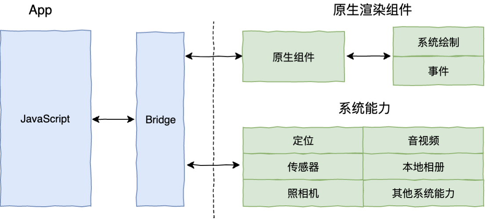

# 跨平台技术

## 三个阶段

**Web 容器时代**

基于 Web 相关技术通过浏览器组件来 实现界面及功能，典型的框架包括 Cordova(PhoneGap)、Ionic 和微信小程序。 


**泛 Web 容器时代**

能否 对笨重的 Web 容器进行功能裁剪，在仅保留必要的 Web 标准和渲染能力的基础上，使得友好的开发体验与稳定的渲染性能保持一个平衡?

采用类 Web 标准进行开发，但在运行时把绘制和渲染交由原生系统接管的技术，代表框架有 React Native、Weex 和快应用，广义的还包括天猫的 Virtual View 等。 



**自绘引擎时代**

自带渲染引擎，客户端仅提供一块画布即 可获得从业务逻辑到功能呈现的多端高度一致的渲染体 验。Flutter，是为数不多的代表。


## flutter

### 项目结构

flutter根目录下有几个主要文件夹，lib目录下放置dart文件，所有的逻辑都在这里，iOS目录下放置iOS相关文件。需要用iOS设备调试时，编译完成，会在iOS目录下生成flutter.framework，而AppDeleagate则继承自flutter.framework下的FlutterAppDelegate，所以，只需要如下代码，即可将控制权交给flutter

````objective-c
- (BOOL)application:(UIApplication *)application didFinishLaunchingWithOptions:(NSDictionary *)launchOptions {
  [GeneratedPluginRegistrant registerWithRegistry:self];
  // Override point for customization after application launch.
  return [super application:application didFinishLaunchingWithOptions:launchOptions];
}
````

### 多页面组织与跳转

flutter使用Navigator与Route来处理跳转，下面展示一种比较直观的方式

````dart
//push
Navigator.of(context).push(new MaterialPageRoute(
              builder: (context) {
                return new ReplyPage();
              }
          ));

//pop
Navigator.of(context).pop();
````

还有一种方式，命名路由，可以根据名称进行路由跳转，但是需要实现注册路由表，将路由名称与页面映射。

```dart
MaterialApp(
    ...
	// 注册路由 
  routes:{
      "second_page":(context)=>SecondPage(),
    },
);
//push操作
Navigator.pushNamed(context,"second_page");
```

路由跳转可以增加参数

````dart
Navigator.of(context).pushNamed("second_page", arguments: "Hey");
//可以在页面中通过setting.arguments获取
String msg = ModalRoute.of(context).settings.arguments as String;
````

当路由名称在注册表中找不到时，可以做统一处理

````dart
MaterialApp(
	...
	//注册路由
 	routes:{
 	"second_page":(context)=>SecondPage(),
 	},
 	// 错误路由处理，统一返回 UnknownPage
 	onUnknownRoute: (RouteSettings setting) => MaterialPageRoute(builder: (context) => U
)
````

### 视图布局

#### 容器视图

listview

实现类似tableView的效果

customScrollView

组合多个listView，实现联动效果

#### 普通视图

**单子布局容器**

Container可以控制子视图在容器中的位置

```dart
Container(
	child: Text('Container(容器)在 UI 框架中是一个很常见的概念，Flutter 也不例外。'),
	padding: EdgeInsets.all(18.0), // 内边距
	margin: EdgeInsets.all(44.0), // 外边距
	width: 180.0,
	height:240,
	alignment: Alignment.center, // 子 Widget 居中对齐
	decoration: BoxDecoration( //Container 样式
		color: Colors.red, // 背景色
		borderRadius: BorderRadius.circular(10.0), // 圆角边框
	),
)
 
```

Padding 相对Container做了些定制，应该是从Container衍生？Center应该也是类似。

Container可以通过对参数的定制，实现Padding和Center，所以使用的比较频繁

**多子布局容器**

Row，Column，Expanded

Row与Column分别为横行布局与纵向布局，Expanded则处理内部的填充逻辑

````
Row(
  children: <Widget>[
		Expanded(flex: 1, child: Container(color: Colors.yellow, height: 60)), 
    Container(color: Colors.red, width: 100, height: 180,),
		Container(color: Colors.black, width: 60, height: 80,),
		Expanded(flex: 1, child: Container(color: Colors.green,height: 60),)
	], 
);
````


**层叠布局容器**

stack与positioned

### 生命周期

资源管理&包管理

事件响应

手势

视图层级的结构与渲染


混编

如何在现有项目中引入Flutter

如何在flutter项目中引入原生逻辑

如何通信 methodChannel

flutter页面与原声页面的跳转


dart语言

单线程模型

Mixin

不支持重载

纯粹的面向对象，方法也是对象


Dart

JIT（Just In Time，即时编译） & AOT（Ahead of Time，运行前编译）

使用垃圾回收机制（多生代算法）

单线程模型，使用Isolate实现并发，通过事件循环(Event Looper)在事件队列(Event Queue)上传递消息通信。

面向对象，顶层类型Object

支持范型

除了基础类型（bool，num，string，list，map）都是对象，包括func，可以用于传参

函数不支持重载，支持可选命名参数，参数默认值

访问权限，private（库内访问），public（全局访问），用下划线标示private

没有protocol或者interface概念，可以对类进行继承或者实现，继承就是常规逻辑，实现则表示，将此类当成协议来看待，忽略其实现，只关注方法签名。

通过混入（Mixin）来实现多继承

支持可选类型类似Swift中的optional，但是稍有不同

支持覆写

支持try catch处理错误


参考

https://juejin.im/post/5d6378c45188257e197344c6

https://juejin.im/post/5b098c87f265da0ddd7c92f9?utm_source=gold_browser_extension

<https://zhuanlan.zhihu.com/flutter>